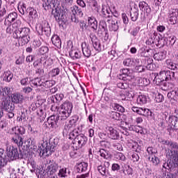

# Patho-SPAR

[](https://www.python.org/)
[](LICENSE)

**Patho-SPAR** searches for prediction-changing H&E appearance variations
within a bounded stain-formation space. Given a fixed pathology classifier, it
optimizes stain-vector orientation, smooth concentration modulation, and a
global optical-density offset rather than unconstrained pixel noise.

The repository contains the differentiable renderer, the classifier-guided
search, command-line interfaces, tests, and the configuration used for the
paper's main attack setting. Classifier checkpoints and full datasets are not
bundled.

## Install

Install a PyTorch build suitable for the local CPU or CUDA device from
[pytorch.org](https://pytorch.org/get-started/locally/), then install
Patho-SPAR:

```bash
git clone https://github.com/a2108870/Patho-SPAR.git
cd Patho-SPAR
python -m venv .venv
source .venv/bin/activate              # Windows: .venv\Scripts\activate
python -m pip install --upgrade pip
python -m pip install -e .
```

## Try it

Run the bundled smoke test before supplying a checkpoint:

```bash
python examples/smoke_test.py
```

It runs the complete renderer and optimization path on the included real H&E
tile and writes `outputs/smoke_test_patho_spar.png`. The demonstration
classifier is deliberately simple, so this verifies the installation rather
than reporting a pathology-model result.



The tile is a Macenko-normalized `TUM` patch from
[NCT-CRC-HE-100K](https://doi.org/10.5281/zenodo.1214456), included under its
CC BY 4.0 terms. See [`examples/README.md`](examples/README.md) for provenance.

## Attack an image

Patho-SPAR accepts unnormalized RGB tensors in `[0, 1]` and leaves the
classifier fixed throughout the search.

```python
from patho_spar import PathoSPAR, PathoSPARConfig

attack = PathoSPAR(model, PathoSPARConfig())
result = attack(images)

adversarial_images = result.adversarial_images
success = result.success
```

The default classifier transform is ImageNet normalization. For a model that
preprocesses its own inputs, pass `normalize=None`.

For a local `timm` checkpoint, use:

```bash
patho-spar-attack \
  --architecture resnet50 \
  --num-classes 2 \
  --checkpoint checkpoints/model.pth \
  --image examples/nct_crc_tum_example.png \
  --output outputs/patho_spar.png \
  --config configs/paper_attack.yaml \
  --device cuda:0
```

The command saves the perturbed image and a same-name JSON report. Add
`--normalization none` only when the checkpoint's model already normalizes its
own inputs.

## Evaluate a dataset

`patho-spar-evaluate` reads a CSV manifest with `path` and zero-based integer
`label` columns. It attacks only initially correct samples and writes attack
success rate, prediction transitions, configuration, and checkpoint metadata
to JSON.

```csv
path,label
relative/path/to/patch_0001.png,0
relative/path/to/patch_0002.png,1
```

```bash
patho-spar-evaluate \
  --architecture resnet50 \
  --num-classes 2 \
  --checkpoint checkpoints/model.pth \
  --manifest examples/manifest.example.csv \
  --data-root /path/to/images \
  --output outputs/results.json \
  --config configs/paper_attack.yaml \
  --device cuda:0
```

## Configuration

[`configs/paper_attack.yaml`](configs/paper_attack.yaml) records the main
setting: a shared `4 x 4` low-frequency DCT field, bounded H/E concentration
changes and stain-vector rotations, a global OD offset, and 100 Adam steps.
Use a separate YAML file when evaluating another attack budget.

## Layout

```text
src/patho_spar/
|-- stain.py       # RGB/OD conversion and H&E decomposition
|-- dct.py         # smooth concentration field
|-- renderer.py    # differentiable stain-formation renderer
|-- attack.py      # classifier-guided optimization
`-- cli/           # single-image and manifest entry points
examples/          # bundled tile and smoke test
tests/             # numerical and CLI tests
```

## Development

```bash
python -m pip install -e ".[dev]"
python -m ruff check src tests
python -m ruff format --check src tests
python -m pytest -q
```

## License

Released under the [MIT License](LICENSE).
